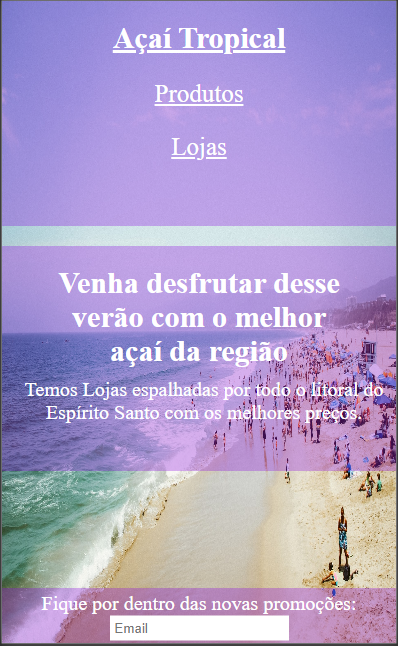
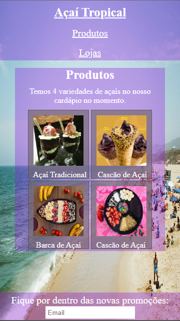
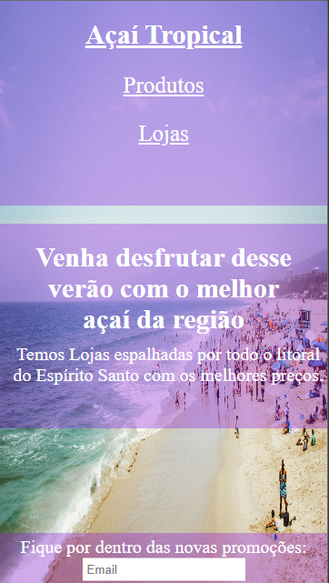
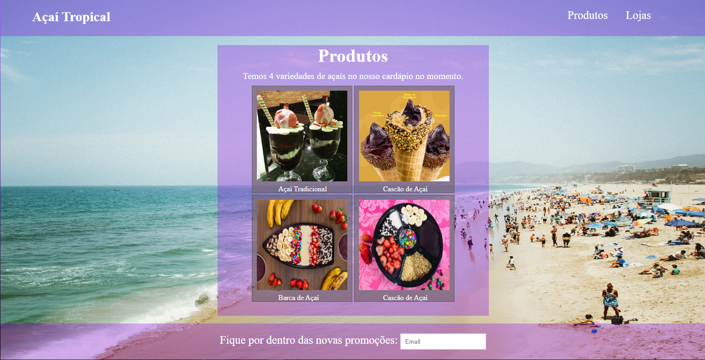
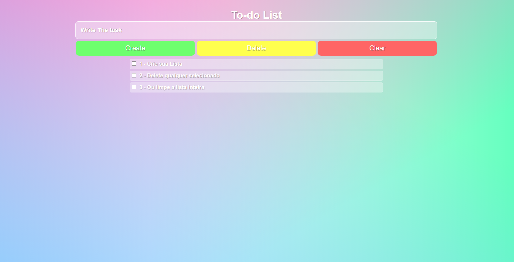
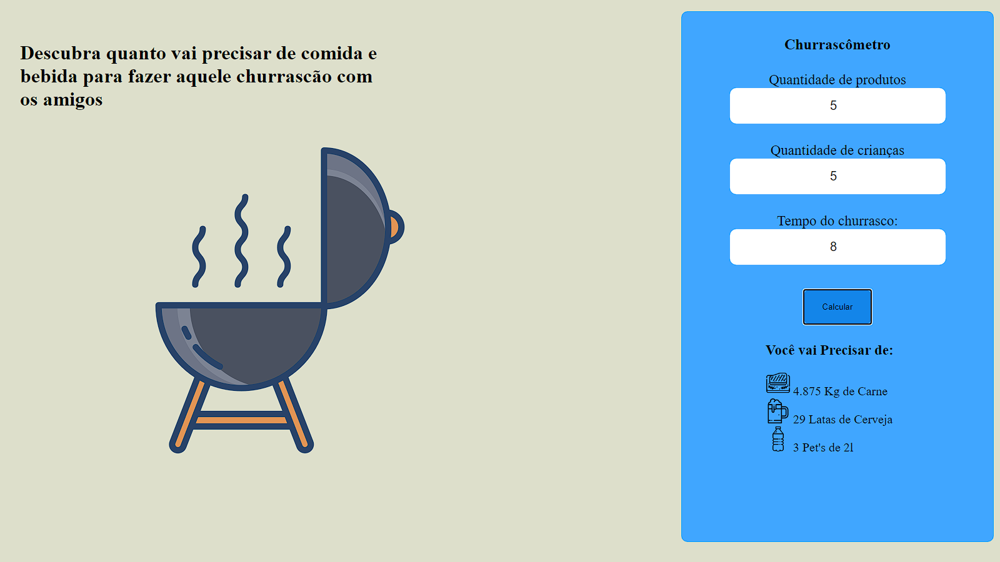

<h1 align="center">
      <a href="https://github.com/Pluto-ty/Ao-caminho-do-Full-Stack" alt="Ao caminho do Full Stack"> Ao caminho do Full Stack </a>
</h1

<h3 align="center">
    Reposítorio pessoal com conteúdo do que aprendi no curso Desenvolvimento Web Full stack do programador br.
</h3>

  

  
  
  
    
   
   
 
  
  
 

<h4 align="center">
	🚧  Em andamento 🚧
</h4>

 <a href="#---sobre-o-repositório-">Sobre o projeto</a> •
 <a href="#--como-executar-o-projeto-">Como executar o projeto</a> •
 <a href="#-projetos-">Projetos</a> • 
 <a href="#-como-contribuir-no-projeto">Como contribuir no projeto</a> • 
 <a href="#-autor">Autor</a> • 
 <a href="#user-content--licença">Licença</a>

---

<h2 align="center"> 💻  Sobre o repositório </h2>

Esse repositório é totalmente focado na minha caminhada de aprendizado para ser um desenvolvedor full stack focado no front-end. Desde o básico do HTML, CSS E JavaScript até as partes avançadas utilizando Node.js, MongoDB, React entre outros. Abaixo você vai ver alguns dos meus projetos feitos durante o curso e os com mais funcionalidades e trabalhados vão ter repositórios próprios com suas páginas para teste na sua máquina.

<h4 align="center">🚧 Aviso 🚧</h4>

Códigos comentados para minha própria revisada se precisar, se houver algo que acha que pode ser melhorado, não tenha medo de me comunicar isso me ajuda no meu crescimento profissional.

---

<h2 align="center"> 🚀 Como executar o projeto </h2>

 Este projeto por enquanto só tem Front-end. 

<h3 align="center"> Pré-requisitos </h3>

Antes de começar, você vai precisar ter instalado em sua máquina as seguintes ferramentas:
[Git](https://git-scm.com) e um bom editor para trabalhar com o código como [VSCode](https://code.visualstudio.com/)

1. Faça clone do projeto- https://github.com/Pluto-ty/Ao-caminho-do-Full-Stack.git
2. Abra com o editor de escolha e modifique,brinque a vontade.

---

<h2 align="center"> Projetos </h2>

<h3 align="center"> -Pagina de Captura

<h4 align="center"> Mobile </h4>

  

   
	
  
 
		
<h4 align="center"> Web </h4>

  

<h3 align="center"> -Loja de Açaí Fictícia 

<h4 align="center"> Mobile </h4>

  

   
   
  
 
		
<h4 align="center"> Web </h4>

  
   
  

<h3 align="center"> To-do list </h3>

<h3 align="center"> Churrascômetro </h3>

---

<h2 align="center"> 💪 Como contribuir no projeto </h2>

1. Faça um **fork** do projeto.
2. Crie uma nova branch com as suas alterações: `git checkout -b my-feature`
3. Salve as alterações e crie uma mensagem de commit contando o que você fez: `git commit -m "feature: My new feature"`
4. Envie as suas alterações: `git push origin my-feature`

---

<h2 id="-autor"> Autor </h2>

<a href="https://github.com/Pluto-ty">
 
  
 <b>Thyago Araujo</b></a> </a>
  

---

## 📝 Licença

Este projeto esta sobe a licença [MIT](./LICENSE.md).

Feito com ❤️ por Thyago Araujo 👋🏽 [Entre em contato!](https://www.linkedin.com/in/thyago-araujo-m/)

---
