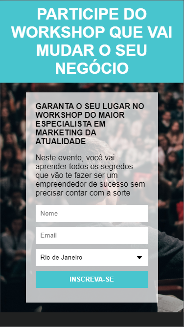
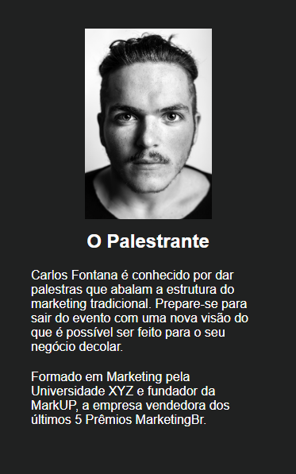

<h1 align="center">
     🕹️ <a href="#" alt="Ao caminho do Full Stack"> Ao caminho do Full Stack </a>
</h1>

<h3 align="center">
    Reposítorio pessoal com conteúdo do que aprendi no curso Desenvolvimento Web Full stack do programador br.
</h3>

<p align="center">
  

  
  
  <a href="https://github.com/Pluto-ty/README/commits/master">
    
  </a>
    
   
   <a href="https://github.com/Pluto-ty/Ao-caminho-do-Full-Stack/stargazers">
    
  </a>
 
  <a href="https://github.com/Pluto-ty">
    
    </a>
  
 
</p>

<h4 align="center">
	🚧  Em andamento 🚧
</h4>

<h2> Tabela de conteúdos </h2>

<!--ts-->

- [Sobre o projeto](#-sobre-o-projeto)
- [Como executar o projeto](#-como-executar-o-projeto)
  - [Pré-requisitos](#pré-requisitos)
- [Tecnologias](#-tecnologias)
- [Como contribuir no projeto](#-como-contribuir-no-projeto)
- [Autor](#-autor)
- [Licença](#user-content--licença)
<!--te-->

---

<h2> 💻 Sobre o repositório </h2>

Esse repositório é totalmente focado na minha caminhada de aprendizado para ser um desenvolvedor full stack focado no front-end.

<h4>🚧 Aviso 🚧</h4>

<p>
Códigos comentados para minha própria revisada se precisar, se houver algo que acha que pode ser melhorado, não tenha medo de me comunicar isso me ajuda no meu crescimento profissional.
</p>
---

<h2> Projetos </h2>

<h3> Pagina de Captura

### Mobile


  <p align="center"; margin="0"; width="100%">
   
  </p> 
  <p align="center"; margin="0"; width="100%">
   
  </p> 
	
	
### Web

<p align="center" style="display: flex; align-items: flex-start; justify-content: center;">
  
</p>

---

<h2> 🚀 Como executar o projeto </h2>

Este projeto é divido em três partes:

2. Frontend (pasta web)
3. Mobile (pasta mobile)

### Pré-requisitos

Antes de começar, você vai precisar ter instalado em sua máquina as seguintes ferramentas:
[Git](https://git-scm.com) e um bom editor para trabalhar com o código como [VSCode](https://code.visualstudio.com/)

#### 🧭 Rodando a aplicação web (Frontend)

```bash

# Clone este repositório
$ git clone git@github.com:tgmarinho/README-ecoleta.git

# Acesse a pasta do projeto no seu terminal/cmd
$ cd README-ecoleta

# Vá para a pasta da aplicação Front End
$ cd web

# Instale as dependências
$ npm install

# Execute a aplicação em modo de desenvolvimento
$ npm run start

# A aplicação será aberta na porta:3000 - acesse http://localhost:3000

```

---

---

## 💪 Como contribuir no projeto

1. Faça um **fork** do projeto.
2. Crie uma nova branch com as suas alterações: `git checkout -b my-feature`
3. Salve as alterações e crie uma mensagem de commit contando o que você fez: `git commit -m "feature: My new feature"`
4. Envie as suas alterações: `git push origin my-feature`

---

## Autor

<a href="https://github.com/Pluto-ty">
 
 <br />
 <sub><b>Thyago Araujo</b></sub></a> </a>
 <br />

[](https://www.linkedin.com/in/thyago-araujo-m/)
[](mailto:thyagoaraujomotta@gmail.com)

---

## 📝 Licença

Este projeto esta sobe a licença [MIT](./LICENSE.md).

Feito com ❤️ por Thyago Araujo 👋🏽 [Entre em contato!](https://www.linkedin.com/in/thyago-araujo-m/)

---
